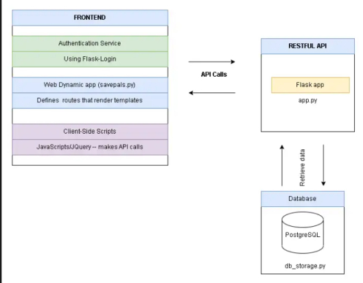
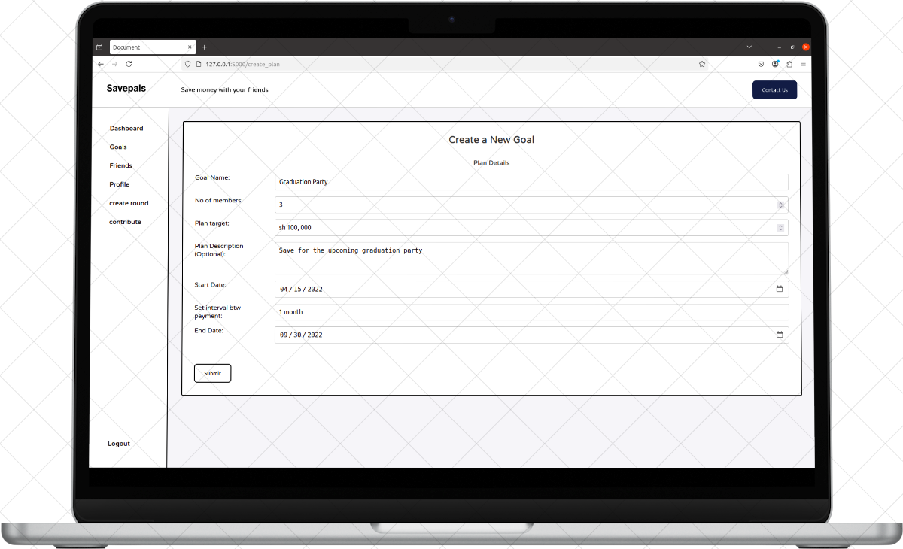

# **SavePals**

**SavePals** is a collaborative financial savings application designed to help friends contribute toward shared financial goals—offering a modern alternative to traditional loans. This repository contains the source code for both the API backend and the dynamic web interface.

---

## **Overview**

SavePals empowers groups of friends to collectively save money toward defined goals. Users can create savings groups, manage contributions, and track financial progress through an intuitive dashboard. Built using Flask and PostgreSQL, SavePals offers a seamless experience for transparent and collaborative financial planning.

---

## **How It Works**

The application consists of two main components:

- **API Server**: Defines the RESTful endpoints that interact with the database.
- **Web Interface (`web_dynamic`)**: Renders HTML templates and fetches data via jQuery-driven API calls.



---

## **Table of Contents**

- [Features](#features)  
- [Tech Stack](#tech-stack)  
- [Installation](#installation)  
- [Setup](#setup)  
- [Testing](#testing)  
- [API Endpoints](#api-endpoints)  
- [Contributing](#contributing)  
- [Project Screenshot](#project-screenshot)  
- [License](#license)

---

## **Features**

1. **Create & Manage Plans**: Define savings goals, monitor progress, and manage contributions.  
2. **Contribution Tracking**: View contributions and monitor each participant’s progress.  
3. **Visual Progress Indicators**: Dynamic charts and progress bars to illustrate group status.  
4. **User Authentication**: Secure login and logout workflows.  
5. **Personalized Dashboard**: Real-time insights into contributions, upcoming payouts, and group statistics.  
6. **Friend Management**: Display detailed information about friends in each plan.

---

## **Tech Stack**

- **Frontend**: HTML, CSS, JavaScript (jQuery)  
- **Backend**: Python (Flask)  
- **Database**: PostgreSQL (via SQLAlchemy ORM)  
- **Styling**: CSS

---

## **Installation**

### **Prerequisites**

- Python 3.12+  
- PostgreSQL  
- Virtualenv (recommended)

### **Clone the Repository**

```bash
git clone https://github.com/luckys-lnz/savepals.git
cd savepals
```

### **Create Virtual Environment**

```bash
python3 -m venv .venv
source .venv/bin/activate
```

### **Install Dependencies**

```bash
pip install -r requirements.txt
```

### **Install PostgreSQL (if not already installed)**

Ubuntu:

```bash
sudo apt install postgresql
```

Arch:

```bash
sudo pacman -S postgresql
```

---

## **Setup**

### **Create PostgreSQL Databases**

```bash
sudo -i -u postgres
createdb savepals_db
```

### **Environment Variables**

Create a `.env` file in the project root directory with the following configuration:

```env
SAVEPAL_POSTGRES_USER=savepals_dev
SAVEPAL_POSTGRES_PWD=savepals_dev_pwd
SAVEPAL_POSTGRES_HOST=localhost
SAVEPAL_POSTGRES_DB=savepals_dev_db
SAVEPAL_API_HOST=0.0.0.0
SAVEPAL_API_PORT=5001
SAVEPAL_ENV=development
```

### **Start the Application**

**Activate the virtual environment:**

```bash
source .venv/bin/activate
```

**Run the API server:**

```bash
python3 -m api.v1.app
```

**Run the dynamic web server:**

```bash
python3 -m web_dynamic.savepals
```

Visit the application in your browser:  
[http://127.0.0.1:5000](http://127.0.0.1:5000)

---

## **Testing**

### **Run Unit Tests**

1. Switch to the project root directory:

    ```bash
    cd savepals
    ```

2. Update your `.env` file:

    ```env
    SAVEPAL_ENV=test
    SAVEPAL_POSTGRES_USER=savepals_test
    SAVEPAL_POSTGRES_PWD=savepals_test_pwd
    ```

3. Run the tests:

    ```bash
    python3 -m unittest discover tests 2>&1 /dev/null | tail -n 1
    ```

---

## **API Endpoints**

### **Group Management**

| Endpoint | Method | Description |
|---------|--------|-------------|
| `/api/v1/groups` | GET | Retrieve all groups |
| `/api/v1/groups` | POST | Create a new group |
| `/api/v1/groups/<group_id>` | DELETE | Delete a group |
| `/api/v1/groups/<group_id>/users` | GET | List users in a group |
| `/api/v1/groups/<group_id>/rounds` | GET | List contribution rounds |
| `/api/v1/groups/<group_id>` | PUT | Update group details |
| `/api/v1/groups/<group_id>/users/<user_id>` | POST/DELETE | Add/Remove user |
| `/api/v1/groups/<group_id>/rounds/<round_id>` | POST/DELETE | Add/Remove round |
| `/api/v1/groups/<group_id>/payouts/<payout_id>` | POST/DELETE | Add/Remove payout |
| `/api/v1/groups/<group_id>/contributions/<contribution_id>` | POST/DELETE | Add/Remove contribution |

### **User Management**

| Endpoint | Method | Description |
|---------|--------|-------------|
| `/api/v1/users` | GET | Retrieve all users |
| `/api/v1/users/<user_id>` | PUT | Update user info |
| `/api/v1/users/<user_id>/groups` | GET | List user's groups |
| `/api/v1/users/<user_id>/payouts/<payout_id>` | POST/DELETE | Add/Remove payout |
| `/api/v1/users/<user_id>/contributions/<contribution_id>` | POST/DELETE | Add/Remove contribution |
| `/api/v1/users/<user_id>/transactions` | GET | List user's transactions |
| `/api/v1/users/<user_id>/groups/<group_id>/transactions` | GET | User’s transactions in a group |

### **Transaction Management**

| Endpoint | Method | Description |
|---------|--------|-------------|
| `/api/v1/transactions/contributions/<contribution_id>` | GET | Get contribution details |
| `/api/v1/transactions/payments/<payment_id>` | GET | Get payment details |
| `/api/v1/groups/<group_id>/transactions` | GET | Get all transactions for a group |
| `/api/v1/rounds/<round_id>/transactions` | GET | Get transactions for a round |

### **Dashboard Management**

| Endpoint | Method | Description |
|---------|--------|-------------|
| `/api/v1/groups/<group_id>/summary` | GET | Retrieve group summary |
| `/api/v1/groups/<group_id>/rounds/<round_id>/summary` | GET | Retrieve round summary |

### **Round Management**

| Endpoint | Method | Description |
|---------|--------|-------------|
| `/api/v1/groups/<group_id>/rounds` | GET | List all rounds in a group |
| `/api/v1/groups/<group_id>/rounds` | POST | Create a new round |
| `/api/v1/groups/<group_id>/rounds/<round_id>` | GET | Retrieve round details |

---

## **Contributing**

We welcome contributions from the community! To contribute:

1. Fork the repository.  
2. Create a feature branch.  
3. Make your changes and commit them.  
4. Push to your fork and submit a pull request.

Please follow PEP8 coding standards and document your code clearly.

---

## **Project Screenshot**



---

## **License**

This project is licensed under the MIT License. See the [LICENSE](LICENSE) file for details.